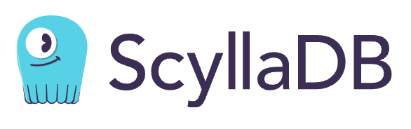

# Hello! I'm Dylan!

I'm currently a Computer Science senior at Purdue University, graduating in May 2026. I have 3+ years of professional programming experience and am currently working on projects including:
- [PickOne](https://github.com/dadal00/PickOne)
- [C The Web](https://github.com/dadal00/c_the_web)

dylanadal.00@gmail.com

## Skills

### Programming Languages

### Frameworks

### Cloud Tools

### Development

### Microservices

### Devops

### Data Science

### Other

